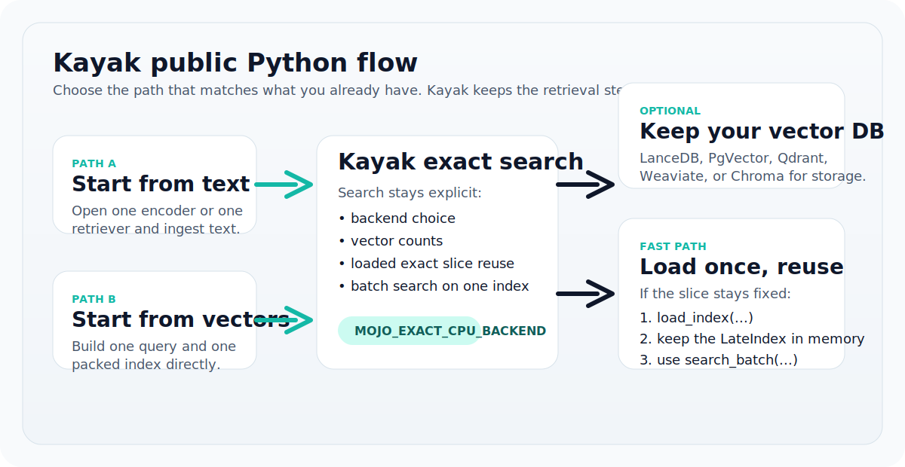

---
hide:
  - toc
---

Kayak Documentation

# Late-interaction retrieval for Python, with a real Mojo-backed exact path

Use Kayak when you want exact local late-interaction search, an explicit Python
API, and a practical path to keep your existing vector database for storage
while Kayak takes over search and surfacing.

[Get started](installation.md){ .md-button .md-button--primary }
[Choose a workflow](start-here.md){ .md-button }
[Open examples](examples.md){ .md-button }

- `Mojo exact CPU backend`
- `Text-to-search retriever APIs`
- `Exact loaded-slice search`
- `LanceDB / PgVector / Qdrant / Weaviate / Chroma`

<aside class="kayak-hero__aside" markdown>

<ul class="kayak-stat-list">
  <li>
    Best first step
    Install Kayak in one environment where a usable <code>mojo</code> CLI is visible.
  </li>
  <li>
    Default high-level API
    <code>kayak.open_text_retriever(...)</code> for text workflows and repeated local search.
  </li>
  <li>
    Database story
    Keep the DB for persistence, let Kayak own the exact searchable slice.
  </li>
</ul>

</aside>

## Start With The Path That Matches Your Situation

The docs are organized for actual decisions, not for internal type names. Pick
the entry point that matches what you already have.

<section class="kayak-card kayak-card--accent" markdown>
### I want one working Mojo setup

Start here if your goal is simply to get a verified local install and run exact
search from Python.

[Installation](installation.md)
[Quickstart](quickstart.md)
</section>

<section class="kayak-card" markdown>
### I start from text

Use the encoder plus retriever workflow when your corpus begins as raw text and
you want one ergonomic Python object for ingest and search.

[Text Encoders](text-encoders.md)
[Usage Patterns](usage-patterns.md)
</section>

<section class="kayak-card" markdown>
### I already have a vector database

Keep the database for storage, filters, and operational ownership. Materialize
an exact slice into Kayak and search that slice directly.

[Storage + Search](storage-and-search.md)
[Vector Databases](vector-databases.md)
</section>

<section class="kayak-card" markdown>
### I care about throughput and repeated queries

Use one loaded slice, batch search, and the hosted same-snapshot path when the
data changes more slowly than the query traffic.

[Usage Patterns](usage-patterns.md)
[Hosted Engine Python](hosted-engine-python.md)
</section>

## What Kayak Owns

Kayak is opinionated about the retrieval boundary. The API keeps the expensive
and quality-critical parts explicit so you can measure them and change them on
purpose.

<section class="kayak-card" markdown>
### Explicit search semantics

- query vector count
- document vector count
- index layout
- backend choice
- candidate window size
</section>

<section class="kayak-card" markdown>
### Reliable Python ergonomics

- `kayak.help()` for discoverability
- `kayak.doctor()` for environment diagnostics
- retriever and session APIs for repeated-query workloads
</section>

<section class="kayak-card" markdown>
### Storage handoff, not storage replacement

- keep LanceDB, PgVector, Qdrant, Weaviate, or Chroma if you already use them
- let Kayak materialize the exact slice
- let Kayak run the search path you actually benchmark
</section>

<figure class="kayak-figure">
  
  <figcaption>Public mental model: text or vectors in, exact searchable slice out, optional database persistence on the side.</figcaption>
</figure>

## Recommended Reading Order

<section class="kayak-card" markdown>
### 1. Install correctly

Make sure Kayak can discover a usable `mojo` CLI in the same environment as the
Python package.

[Open installation guide](installation.md)
</section>

<section class="kayak-card" markdown>
### 2. Run one exact search

Use the shortest verified script or notebook before adding adapters or plans.

[Open quickstart](quickstart.md)
</section>

<section class="kayak-card" markdown>
### 3. Choose the long-term API shape

Move to retrievers, loaded slices, batch search, or plans only after the base
path is working.

[Open usage patterns](usage-patterns.md)
</section>

## Open The Right Artifact

| If you want to... | Open... |
| --- | --- |
| decide by your current situation | [Choose Your Path](start-here.md) |
| install Kayak and make Mojo show up correctly | [Installation](installation.md) |
| run the shortest possible exact search | [Quickstart](quickstart.md) |
| pass a Hugging Face ColBERT checkpoint or your own model | [Text Encoders](text-encoders.md) |
| keep your existing vector database | [Storage + Search](storage-and-search.md) |
| compare database-specific adapter behavior | [Vector Databases](vector-databases.md) |
| open runnable notebooks and scripts | [Examples](examples.md) |
| inspect the stable public signatures | [Python API](api.md) |

## If You Want The Mojo Backend

`uv add kayak` installs the Python SDK. It does not install Mojo.

If your goal is the Mojo exact backend, the requirement is simple and explicit:
Kayak must be able to find a usable `mojo` CLI in the same environment, on
`PATH`, or through `KAYAK_MOJO_CLI`.

Use the [installation guide](installation.md) for the verified setup shapes and
the exact checks to run after install.
