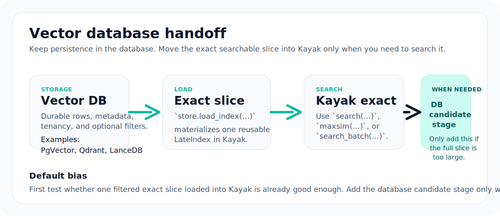
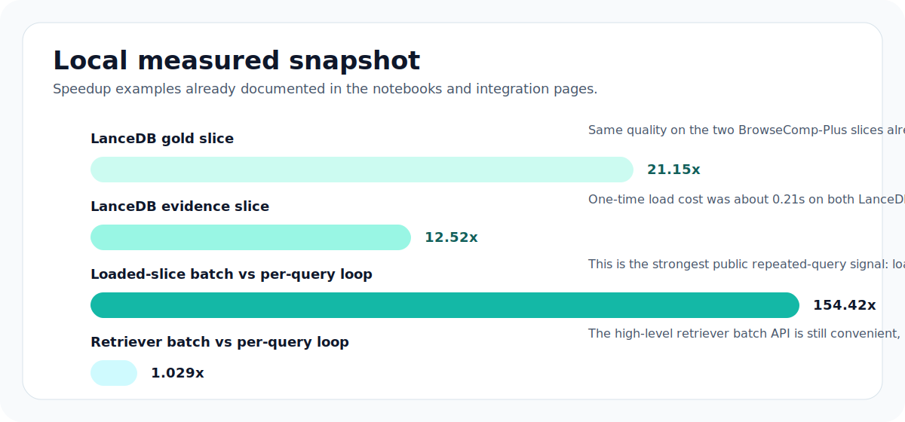

<div class="kayak-hero kayak-hero--compact" markdown>
<div class="kayak-hero__main" markdown>

<p class="kayak-eyebrow">Database handoff</p>

# Keep the database for storage. Let Kayak own the exact search step.

<p class="kayak-lead">
If you already use a vector database, the default Kayak pattern is simple:
leave persistence where it is, materialize one exact searchable slice into
Kayak, and run search on that slice directly.
</p>

<div class="kayak-action-row" markdown>

[Vector Databases](vector-databases.md){ .md-button .md-button--primary }
[Examples](examples.md){ .md-button }

</div>

</div>
<aside class="kayak-hero__aside" markdown>

<ul class="kayak-link-list">
  <li><strong>Default bias</strong> full exact Kayak search when the slice already fits locally</li>
  <li><strong>When to add stage 1</strong> only when the database really needs to reduce the working set first</li>
  <li><strong>Best repeated-query path</strong> <code>load_index(...)</code> once, then <code>search_batch(...)</code></li>
</ul>

</aside>
</div>

<figure class="kayak-figure">
  
  <figcaption>Default storage pattern: keep persistence in the database, materialize an exact slice into Kayak, and search that slice directly.</figcaption>
</figure>

## Recommended Operating Model

| Situation | Default choice | Why |
| --- | --- | --- |
| the searchable slice fits locally | full Kayak exact retrieval | simplest path and easiest thing to measure |
| the database is already your durable system of record | `open_store(...)` plus `load_index(...)` | keeps persistence where it is and gives Kayak a reusable exact slice |
| many queries hit the same fixed slice | `load_index(...)` once, then `search_batch(...)` | avoids repeated slice materialization |
| the full slice is too large or must be routed first | database candidate stage plus exact Kayak search | use the DB only when it materially reduces the working set |

## Choose The Storage Shape

<div class="kayak-card-grid" markdown>

<section class="kayak-card kayak-card--accent" markdown>
### Full Kayak retrieval

Use this when the searchable slice fits on the target host and you do not need
a database-side candidate stage.
</section>

<section class="kayak-card" markdown>
### Database for storage, Kayak for search

Use this when the database is your durable store and you want Kayak to own
retrieval on the filtered working set.
</section>

<section class="kayak-card" markdown>
### Database candidate stage first

Use this only when the full slice is too large to search directly or when the
database must route first.
</section>

<section class="kayak-card" markdown>
### Same slice, many queries

Use this when the slice changes slowly and query traffic is the moving part.
</section>

</div>

## Local Evidence Snapshot

These are local measured examples from the executed notebooks. They are useful
deployment evidence, not universal benchmark claims.

| Scenario | Measured result | Interpretation |
| --- | --- | --- |
| BrowseComp-Plus gold slice from LanceDB | same NDCG@10, Kayak exact search `21.154376159357273x` faster after a one-time `0.20880537503398955` second load | when the slice fits, loading once and searching in Kayak can preserve quality while reducing search time |
| BrowseComp-Plus evidence slice from LanceDB | same NDCG@10, Kayak exact search `12.52156994765039x` faster after a one-time `0.21453558304347098` second load | the same storage-first, search-in-Kayak pattern held on a second slice |
| repeated-query LanceDB slice example | explicit loaded-slice `search_batch(...)` was `154.42x` faster than looping `retriever.search_text(...)` | once the slice is loaded, batch search is the right public fast path |
| repeated-query example through the high-level retriever | `retriever.search_text_batch(...)` was `1.029x` vs a per-query loop | retriever batching is mainly ergonomic; the main gain comes from reusing the explicit slice |

<figure class="kayak-figure">
  
  <figcaption>Current local examples already documented in the notebooks: the biggest gains come from exact loaded-slice reuse, not from hiding the workflow.</figcaption>
</figure>

## Default Recommendation

Use full Kayak retrieval when the searchable slice:

- fits on the target host
- can be refreshed on your normal update cadence
- does not need a database-side candidate stage before search

That is usually the cleanest production shape:

```python
import kayak

retriever = kayak.open_text_retriever(
    encoder="colbert",
    store="kayak",
    encoder_kwargs={"model_name": "colbert-ir/colbertv2.0"},
    store_kwargs={"path": "./kayak-index"},
)

retriever.upsert_texts(doc_ids, texts, metadata=metadata_rows)
hits = retriever.search_text(query_text, k=10, where={"tenant": "acme"})
```

If you already own vectors rather than text, the equivalent lower-level shape
is:

```python
import numpy as np
import kayak

rows = vector_db.fetch_all()

index = kayak.documents(
    [row["doc_id"] for row in rows],
    [np.asarray(row["vector"], dtype=np.float32) for row in rows],
    texts=[row["text"] for row in rows],
).pack()

query = kayak.query(query_vectors, text=query_text)
hits = kayak.search(
    query,
    index,
    k=10,
    backend=kayak.MOJO_EXACT_CPU_BACKEND,
)
```

## Public Store Adapters

Use the public store adapters when the storage layer is already one of the
supported systems and you want to avoid writing your own row-to-index bridge.

| Store | Open with |
| --- | --- |
| LanceDB | `kayak.open_store("lancedb", path=..., table_name=...)` |
| PgVector | `kayak.open_store("pgvector", dsn=... | connection=..., table_name=..., schema_name=...)` |
| Qdrant | `kayak.open_store("qdrant", client=... | path=..., collection_name=...)` |
| Weaviate | `kayak.open_store("weaviate", client=... | persistence_path=..., collection_name=..., vector_name=...)` |
| Chroma | `kayak.open_store("chromadb", client=... | path=..., collection_name=...)` |

Prefer the context-manager form when the adapter may own cleanup-sensitive
resources:

```python
with kayak.open_store("qdrant", client=my_qdrant_client, collection_name="docs") as store:
    store.upsert(documents, metadata=metadata_rows)
    index = store.load_index(include_text=True)
```

Store-specific `where=` behavior is not identical across adapters. Use
[Vector Databases](vector-databases.md) for the adapter-by-adapter semantics
before assuming pushdown behavior.

## Repeated Queries Against The Same Stored Slice

If the underlying rows stay fixed for a while, the verified fast path is:

1. load one exact Kayak slice once
2. reuse that `LateIndex` for many queries
3. use `search_batch(...)` when those queries arrive together

```python
with kayak.open_store("pgvector", dsn=dsn, table_name="docs") as store:
    index = store.load_index(where={"tenant": "acme"}, include_text=True)

batch = kayak.query_batch([query_a_vectors, query_b_vectors, query_c_vectors])
hits_by_query = kayak.search_batch(
    batch,
    index,
    k=10,
    backend=kayak.MOJO_EXACT_CPU_BACKEND,
)
```

The executed example for this path is:

- [batch-search-on-one-loaded-lancedb-slice.ipynb](notebooks/batch-search-on-one-loaded-lancedb-slice.ipynb)

## What This Page Does Not Promise

The public `LateStore` protocol does not currently promise generic thread-safe
concurrent use of the same store instance across every adapter.

What is verified and supported today is:

- repeated queries against one loaded `LateIndex`
- batched queries against one loaded `LateIndex`
- explicit concurrent same-snapshot serving through `import kayak_engine`

If you want many same-process callers to share one fixed hosted snapshot, use
the prepared scheduler from [Hosted Engine Python](hosted-engine-python.md)
instead of assuming that shared concurrent `open_store(...)` use is the
intended scale-out path.
